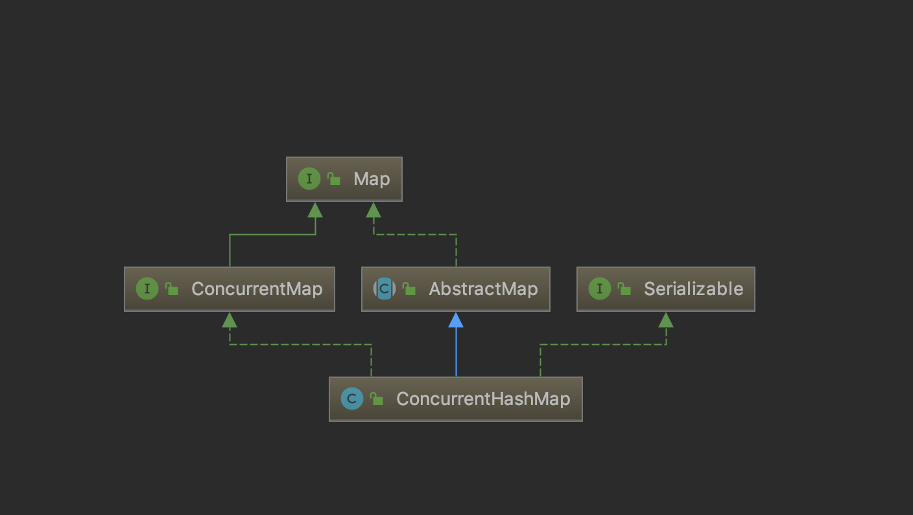

```java
public V put(K key, V value) {
    return putVal(key, value, false);
}
```
```java
/** Implementation for put and putIfAbsent */
    final V putVal(K key, V value, boolean onlyIfAbsent) {
        if (key == null || value == null) throw new NullPointerException();
        int hash = spread(key.hashCode());
        int binCount = 0;
        for (Node<K,V>[] tab = table;;) {
            Node<K,V> f; int n, i, fh;
            if (tab == null || (n = tab.length) == 0)
                tab = initTable();
            //如果
            else if ((f = tabAt(tab, i = (n - 1) & hash)) == null) {
                if (casTabAt(tab, i, null,
                             new Node<K,V>(hash, key, value, null)))
                    break;                   // no lock when adding to empty bin
            }
            else if ((fh = f.hash) == MOVED)
                tab = helpTransfer(tab, f);
            else {
                V oldVal = null;
                synchronized (f) {
                    if (tabAt(tab, i) == f) {
                        if (fh >= 0) {
                            binCount = 1;
                            for (Node<K,V> e = f;; ++binCount) {
                                K ek;
                                if (e.hash == hash &&
                                    ((ek = e.key) == key ||
                                     (ek != null && key.equals(ek)))) {
                                    oldVal = e.val;
                                    if (!onlyIfAbsent)
                                        e.val = value;
                                    break;
                                }
                                Node<K,V> pred = e;
                                if ((e = e.next) == null) {
                                    pred.next = new Node<K,V>(hash, key,
                                                              value, null);
                                    break;
                                }
                            }
                        }
                        else if (f instanceof TreeBin) {
                            Node<K,V> p;
                            binCount = 2;
                            if ((p = ((TreeBin<K,V>)f).putTreeVal(hash, key,
                                                           value)) != null) {
                                oldVal = p.val;
                                if (!onlyIfAbsent)
                                    p.val = value;
                            }
                        }
                    }
                }
                if (binCount != 0) {
                    if (binCount >= TREEIFY_THRESHOLD)
                        treeifyBin(tab, i);
                    if (oldVal != null)
                        return oldVal;
                    break;
                }
            }
        }
        addCount(1L, binCount);
        return null;
    }
```

```java
/**
 * Initializes table, using the size recorded in sizeCtl.
 */
 private final Node<K,V>[] initTable() {
     Node<K,V>[] tab; 
     int sc;
     while ((tab = table) == null || tab.length == 0) {
         //如果一个线程发现sizeCtl<0，意味着另外的线程执行CAS操作成功，当前线程只需要让出cpu时间片
         if ((sc = sizeCtl) < 0)
             Thread.yield(); // 失去了初始化table的机会，就自旋直到while条件不满足，然后返回table。
         else if (U.compareAndSwapInt(this, SIZECTL, sc, -1)) {//使用CAS的方式将sizeCtl更新为-1
             try {
                 if ((tab = table) == null || tab.length == 0) {
                     //默认大小DEFAULT_CAPACITY是16
                     int n = (sc > 0) ? sc : DEFAULT_CAPACITY;
                     @SuppressWarnings("unchecked")
                     //初始化长度为nu的数组table
                     Node<K,V>[] nt = (Node<K,V>[])new Node<?,?>[n];
                     table = tab = nt;
                     //注意 n - (n >>> 2)等价于 n*0.75
                     sc = n - (n >>> 2);
                 }
             } finally {
                 //最后为sizeCtl赋值为table的容量0.75倍
                 sizeCtl = sc;
             }
             break;
         }
     }
     return tab;
 }

```