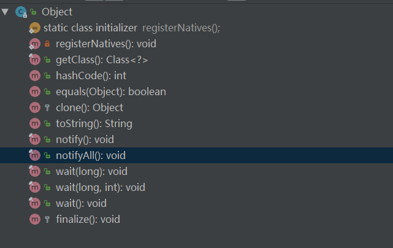

## Java 基础知识

Object类的方法

枚举两个枚举成员应该使用 ==

* 使用集合转数组的方法，必须使用集合的 `<T> T[] toArray(T[] a)` ，传入的是类型完全一样的数组，大小就是 list.size();
直接使用 `Object[] toArray()`无参方法存在问题，此方法返回值只能是 Object[] 类，若强转其它类型数组将出现 ClassCastException 错误。

* 避免出现重复的代码 （Don ’ t Repeat Yourself） ，即 DRY 原则。

### Java 类初始化的顺序

静态代码块->成员变量初始化->初始化代码块->构造函数

# 红黑树

## 二叉查找树

二叉查找树（Binary Search Tree，简称BST）是一棵二叉树，它的左子节点的值比父节点的值要小，右节点的值要比父节点的值大。它的高度决定了它的查找效率。

在理想的情况下，二叉查找树增删查改的时间复杂度为O(logN)（其中N为节点数），最坏的情况下为O(N)。当它的高度为logN+1时，我们就说二叉查找树是平衡的。

BST存在的问题
BST存在的主要问题是，数在插入的时候会导致树倾斜，不同的插入顺序会导致树的高度不一样，而树的高度直接的影响了树的查找效率。
理想的高度是logN，最坏的情况是所有的节点都在一条斜线上，这样的树的高度为N。