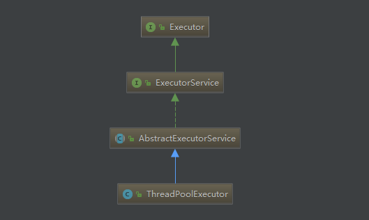

## 进程和线程
操作系统支持同时运行多个任务，一个任务通常就是一个程序，每个运行中的程序就是一个进程。
当一个程序运行时，内部可能包含了多个顺序执行流，每个顺序执行流就是一个线程。
当一个程序进入内存运行时，即变成一个进程。进程是处于运行中的程序，具有一定的独立功能，
进程是系统进行资源分配和调度的一个独立单位。

### 创建线程的三种方式
1. 继承Thread类，重写 run方法。Thread类也是继承了Runnable接口的
2. 实现Runnable接口，重写run方法,然后把Runnable传入Thread的构造函数
3. 使用 Callable接口，可以返回线程执行结果
```java
public class ThreeWayUseThread {

    public static void main(String[] args) {
        firstWay();
        secondWay();
        thirdWay();
    }

    private static void firstWay() {
        new MyThread("firstWay").start();
    }

    private static void secondWay() {
        new Thread(new MyRunnable()).start();
    }

    private static void thirdWay() {
        FutureTask<Integer> futureTask = new FutureTask<Integer>(new Callable<Integer>() {
            @Override
            public Integer call() throws Exception {
                int result = 0;
                for (int i = 0; i < 100; i++) {
                    result += i;
                }
                return result;
            }
        });
        new Thread(futureTask).start();
        try {
            System.out.println(futureTask.get());
        } catch (InterruptedException e) {
            e.printStackTrace();
        } catch (ExecutionException e) {
            e.printStackTrace();
        }
    }

    static class MyThread extends Thread {

        public MyThread(String name) {
            super(name);
        }

        @Override
        public void run() {
            System.out.println(Thread.currentThread().getName());
        }
    }

    static class MyRunnable implements Runnable {

        @Override
        public void run() {
            System.out.println(Thread.currentThread().getName());
        }
    }
}
```


也可以将blocked、waiting、time waiting统称为阻塞状态

### Thread类中的方法
Thread类实现了Runnable接口，在Thread类中，有一些比较关键的属性，比如name是表示Thread的名字，可以通过Thread类的构造器中的参数来指定线程名字，
priority表示线程的优先级（最大值为10，最小值为1，默认值为5），daemon表示线程是否是守护线程，target表示要执行的任务。

1. start方法：用来启动一个线程，当调用start方法后，jvm会调用当前线程的run()方法，
2. 尝试多次调用start()方法会抛出`java.lang.IllegalThreadStateException`
3. 线程执行完毕以后再次调用start()方法也会抛出`java.lang.IllegalThreadStateException`
```java
public synchronized void start() {
        /**
         * This method is not invoked for the main method thread or "system"
         * group threads created/set up by the VM. Any new functionality added
         * to this method in the future may have to also be added to the VM.
         *
         * A zero status value corresponds to state "NEW".
         */
        if (threadStatus != 0)
            throw new IllegalThreadStateException();

        /* Notify the group that this thread is about to be started
         * so that it can be added to the group's list of threads
         * and the group's unstarted count can be decremented. */
        group.add(this);

        boolean started = false;
        try {
            start0();
            started = true;
        } finally {
            try {
                if (!started) {
                    group.threadStartFailed(this);
                }
            } catch (Throwable ignore) {
                /* do nothing. If start0 threw a Throwable then
                  it will be passed up the call stack */
            }
        }
    }

    private native void start0();
```
2. run方法：不需要用户来调用的，当通过start方法启动一个线程之后，当线程获得了CPU执行时间，便进入run方法体去执行具体的任务。注意，继承Thread类
必须重写run方法，在run方法中定义具体要执行的任务。
3. sleep方法
```java
public static native void sleep(long millis) throws InterruptedException;

public static void sleep(long millis, int nanos)
    throws InterruptedException {
        if (millis < 0) {
            throw new IllegalArgumentException("timeout value is negative");
        }

        if (nanos < 0 || nanos > 999999) {
            throw new IllegalArgumentException(
                                "nanosecond timeout value out of range");
        }

        if (nanos >= 500000 || (nanos != 0 && millis == 0)) {
            millis++;
        }

        sleep(millis);
    }

```
sleep相当于让线程睡眠，交出CPU，让CPU去执行其他的任务。但是有一点要非常注意，sleep方法不会释放锁，也就是说如果当前线程持有对某个对象的锁，
则即使调用sleep方法，其他线程也无法访问这个对象。当线程睡眠时间满后，不一定会立即得到执行，因为此时可能CPU正在执行其他的任务。所以说调用sleep
方法相当于让线程进入阻塞状态。
4. yield方法：这个方法极少使用 调用yield方法会让当前线程交出CPU权限，让CPU去执行其他的线程。它跟sleep方法类似，同样不会释放锁。但是yield不能控制
具体的交出CPU的时间，另外，yield方法只能让拥有相同优先级的线程有获取CPU执行时间的机会。注意，调用yield方法并不会让线程进入阻塞状态，而是让线程重
回就绪状态，它只需要等待重新获取CPU执行时间，这一点是和sleep方法不一样的。
```java
public static native void yield();
```
5. join方法：实际上调用join方法以后，只有调用者生命周期结束以后，才执行下面的代码。
```java
public final void join() throws InterruptedException {
        join(0);
    }

public final synchronized void join(long millis)
    throws InterruptedException {
        long base = System.currentTimeMillis();
        long now = 0;

        if (millis < 0) {
            throw new IllegalArgumentException("timeout value is negative");
        }

        if (millis == 0) {
            while (isAlive()) {
                wait(0);
            }
        } else {
            while (isAlive()) {
                long delay = millis - now;
                if (delay <= 0) {
                    break;
                }
                wait(delay);
                now = System.currentTimeMillis() - base;
            }
        }
    }

public final synchronized void join(long millis, int nanos)
    throws InterruptedException {

        if (millis < 0) {
            throw new IllegalArgumentException("timeout value is negative");
        }

        if (nanos < 0 || nanos > 999999) {
            throw new IllegalArgumentException(
                                "nanosecond timeout value out of range");
        }

        if (nanos >= 500000 || (nanos != 0 && millis == 0)) {
            millis++;
        }

        join(millis);
    }

```

看一个例子
```java
public class JoinTest {

    public static void main(String[] args) throws InterruptedException {

        System.out.println(Thread.currentThread().getName() + " is started");

        Thread exampleThread = new Thread(new Runnable() {
            @Override
            public void run() {
                try {
                    System.out.println(Thread.currentThread().getName() + " is started");
                    Thread.sleep(2000);
                    System.out.println(Thread.currentThread().getName() + " is completed");
                } catch (InterruptedException e) {
                    e.printStackTrace();
                }
            }
        });

        exampleThread.start();
        exampleThread.join();
        System.out.println(Thread.currentThread().getName() + " is completed");
    }
}
```
输出结果
```java
main is started
Thread-0 is started
Thread-0 is completed
main is completed

```
可以看到main线程会等待Thread-0线程执行完毕以后，再继续执行。
#### 如何停止一个线程

####### 线程正常执行完毕，正常结束。
1. 停止正在运行的线程

6. interrupt方法：interrupt，即中断的意思。interrupt方法可以中断处于阻塞状态的线程。单独调用interrupt方法可以使得处于阻塞状态的线程抛出一个异常，
也就说。
 ```java
public void interrupt() {
        if (this != Thread.currentThread())
            checkAccess();

        synchronized (blockerLock) {
            Interruptible b = blocker;
            if (b != null) {
                interrupt0();           // Just to set the interrupt flag
                b.interrupt(this);
                return;
            }
        }
        interrupt0();
    }
    
private native void interrupt0();

```
中断处于阻塞状态的线程
```java
public class Test {
     
    public static void main(String[] args) throws IOException  {
        Test volatileTest = new Test();
        MyThread thread = volatileTest.new MyThread();
        thread.start();
        try {
            Thread.currentThread().sleep(2000);
        } catch (InterruptedException e) {
             
        }
        thread.interrupt();
    } 
     
    class MyThread extends Thread{
        @Override
        public void run() {
            try {
                System.out.println("进入睡眠状态");
                Thread.currentThread().sleep(10000);
                System.out.println("睡眠完毕");
            } catch (InterruptedException e) {
                System.out.println("得到中断异常");
            }
            System.out.println("run方法执行完毕");
        }
    }
}
```
不能中断运行中的线程
```java
public class Test {

    public static void main(String[] args) throws IOException  {
        Test volatileTest = new Test();
        MyThread thread = volatileTest.new MyThread();
        thread.start();
        try {
            Thread.currentThread().sleep(2000);
        } catch (InterruptedException e) {

        }
        thread.interrupt();
    }

    class MyThread extends Thread{
        @Override
        public void run() {
            int i = 0;
            while(i<Integer.MAX_VALUE){
                System.out.println(i+" while循环");
                i++;
            }
        }
    }
}
```
运行该程序会发现，while循环会一直运行直到变量i的值超出Integer.MAX_VALUE。所以说直接调用interrupt方法不能中断正在运行中的线程。
但是如果配合isInterrupted()方法就能够中断正在运行的线程，因为调用interrupt方法相当于将中断标志位置为true，那么可以通过调用isInterrupted()判断中断标志是否被置位来中断线程的执行。比如下面这段代码
```java
public boolean isInterrupted() {
        return isInterrupted(false);
    }
    
private native boolean isInterrupted(boolean ClearInterrupted);

```

```java
public class Test {

    public static void main(String[] args) throws IOException  {
        Test volatileTest = new Test();
        MyThread thread = volatileTest.new MyThread();
        thread.start();
        try {
            Thread.currentThread().sleep(2000);
        } catch (InterruptedException e) {

        }
        thread.interrupt();
    }

    class MyThread extends Thread{
        @Override
        public void run() {
            int i = 0;
            while(!isInterrupted() && i<Integer.MAX_VALUE){
                System.out.println(i+" while循环");
                i++;
            }
        }
    }
}

```
运行会发现，打印若干个值之后，while循环就停止打印了。但是一般情况下不建议通过这种方式来中断线程。

一般会在MyThread类中增加一个属性 isStop来标志是否结束while循环，然后再在while循环中判断isStop的值。

```java
public class Test {

    public static void main(String[] args) throws IOException {
        Test volatileTest = new Test();
        MyThread thread = volatileTest.new MyThread();
        thread.start();
        try {
            Thread.currentThread().sleep(2000);
        } catch (InterruptedException e) {
        }
        thread.setStop(true);
    }

    class MyThread extends Thread {
        private volatile boolean isStop = false;

        @Override
        public void run() {
            int i = 0;
            while (!isStop) {
                i++;
                System.out.println(i + " while循环");
            }
        }

        public void setStop(boolean stop) {
            this.isStop = stop;
        }
    }
}
```
那么就可以在外面通过调用setStop方法来终止while循环。
7. stop方法：stop方法已经是一个废弃的方法，它是一个不安全的方法。因为调用stop方法会直接终止run方法的调用，并且会抛出一个ThreadDeath错误，如果线
程持有某个对象锁的话，会完全释放锁，导致对象状态不一致。所以stop方法基本是不会被用到的。
8. destroy方法：已废弃，基本不会使用到

### 以下是关系到线程属性的几个方法：
1. getId方法：获取线程ID
2. getName和setName用来得到或者设置线程名称。
3. getPriority和setPriority用来获取和设置线程优先级。
4. setDaemon和isDaemon用来设置线程是否成为守护线程和判断线程是否是守护线程。
5. currentThread：用来获取当前线程。

守护线程和用户线程的区别在于：守护线程依赖于创建它的线程，而用户线程则不依赖。举个简单的例子：如果在main线程中创建了一个守护线程，当main方法运行
完毕之后，守护线程也会随着消亡。而用户线程则不会，用户线程会一直运行直到其运行完毕。在JVM中，像垃圾收集器线程就是守护线程。

在上面已经说到了Thread类中的大部分方法，那么Thread类中的方法调用到底会引起线程状态发生怎样的变化呢？下面一幅图就是在上面的图上进行改进而来的


### synchronized关键字的使用
在Java中，每一个对象都拥有一个锁标记（monitor），也称为监视器，另外，每个类也会有一个锁，它可以用来控制对static数据成员的并发访问。
(写单例模式的时候的双重检查用的锁就是类的锁)。对于synchronized方法或者synchronized代码块，当出现异常时，JVM会自动释放当前线程占用的锁，因此不会
由于异常导致出现死锁现象。
* 同步方法
1. 当一个线程正在访问一个对象的synchronized方法，那么其他线程不能访问该对象的其他synchronized方法。这个原因很简单，因为一个对象只有一把锁，当一个
线程获取了该对象的锁之后，其他线程无法获取该对象的锁，所以无法访问该对象的其他synchronized方法。
2. 当一个线程正在访问一个对象的synchronized方法，那么其他线程能访问该对象的非synchronized方法。这个原因很简单，访问非synchronized方法不需要获得
该对象的锁，假如一个方法没用synchronized关键字修饰，说明它不会使用到临界资源，那么其他线程是可以访问这个方法的，
3. 果一个线程A需要访问对象object1的synchronized方法fun1，另外一个线程B需要访问对象object2的synchronized方法fun1，即使object1和object2是同一类型）
，也不会产生线程安全问题，因为他们访问的是不同的对象，所以不存在互斥问题。
* 同步代码块
```java
 synchronized (synObject) {
    ...
 }
```
当在某个线程中执行这段代码块，该线程会获取对象synObject的锁，从而使得其他线程无法同时访问该代码块。并且如果一个线程执行一个对象的非
static synchronized方法，另外一个线程需要执行这个对象所属类的static synchronized方法，此时不会发生互斥现象，因为访问static synchronized方法占用
的是类锁，而访问非static synchronized方法占用的是对象锁，所以不存在互斥现象。如下所示
```java
public class Test {

    public static void main(String[] args) {
        final InsertData insertData = new InsertData();
        new Thread() {
            @Override
            public void run() {
                insertData.insert();
            }
        }.start();
        new Thread() {
            @Override
            public void run() {
                insertData.insert1();
            }
        }.start();
    }
}

class InsertData {
    public synchronized void insert() {
        System.out.println("执行insert");
        try {
            Thread.sleep(5000);
        } catch (InterruptedException e) {
            e.printStackTrace();
        }
        System.out.println("执行insert完毕");
    }

    public synchronized static void insert1() {
        System.out.println("执行insert1");
        System.out.println("执行insert1完毕");
    }
}

```
输出结果
```java
执行insert
执行insert1
执行insert1完毕
执行insert完毕

```

如果能用同步代码块就优先使用，因为一个方法可能只有部分代码需要同步,这样可以提高效率。

## volatile 
* volatile 关键字的作用 一旦一个共享变量（类的成员变量、类的静态成员变量）被volatile修饰之后，那么就具备了两层语义

1. 保证了不同线程对这个变量进行操作时的可见性，即一个线程修改了某个变量的值，这新值对其他线程来说是立即可见的。
2. 禁止进行指令重排序。

## 线程池
线程池的作用：复用线程。
[ThreadPoolExecutor的集成结构](ThreadPoolExecutor.uml)

参考链接：[Java并发编程：线程池的使用](http://www.cnblogs.com/dolphin0520/p/3932921.html)

相关的类
* ThreadPoolExecutor

构造函数
```java
public ThreadPoolExecutor(int corePoolSize,
                              int maximumPoolSize,
                              long keepAliveTime,
                              TimeUnit unit,
                              BlockingQueue<Runnable> workQueue) {
        this(corePoolSize, maximumPoolSize, keepAliveTime, unit, workQueue,
             Executors.defaultThreadFactory(), defaultHandler);
    }
    
 public ThreadPoolExecutor(int corePoolSize,
                              int maximumPoolSize,
                              long keepAliveTime,
                              TimeUnit unit,
                              BlockingQueue<Runnable> workQueue,
                              ThreadFactory threadFactory) {
        this(corePoolSize, maximumPoolSize, keepAliveTime, unit, workQueue,
             threadFactory, defaultHandler);
    }
    
public ThreadPoolExecutor(int corePoolSize,
                              int maximumPoolSize,
                              long keepAliveTime,
                              TimeUnit unit,
                              BlockingQueue<Runnable> workQueue,
                              RejectedExecutionHandler handler) {
        this(corePoolSize, maximumPoolSize, keepAliveTime, unit, workQueue,
             Executors.defaultThreadFactory(), handler);
    }
    
 public ThreadPoolExecutor(int corePoolSize,
                              int maximumPoolSize,
                              long keepAliveTime,
                              TimeUnit unit,
                              BlockingQueue<Runnable> workQueue,
                              ThreadFactory threadFactory,
                              RejectedExecutionHandler handler) {
        if (corePoolSize < 0 ||
            maximumPoolSize <= 0 ||
            maximumPoolSize < corePoolSize ||
            keepAliveTime < 0)
            throw new IllegalArgumentException();
        if (workQueue == null || threadFactory == null || handler == null)
            throw new NullPointerException();
        this.acc = System.getSecurityManager() == null ?
                null :
                AccessController.getContext();
        this.corePoolSize = corePoolSize;
        this.maximumPoolSize = maximumPoolSize;
        this.workQueue = workQueue;
        this.keepAliveTime = unit.toNanos(keepAliveTime);
        this.threadFactory = threadFactory;
        this.handler = handler;
    }
    
```
相关参数说明
1. corePoolSize：核心线程池大小,即使核心线程是空闲状态也不会被销毁。除非设置allowCoreThreadTimeOut为true。创建一个线程池以后并不会创建任何新的线程，
而是等待有任务到来才去创建线程执行任务。可以调用`prestartAllCoreThreads()`方法或者`prestartCoreThread()`方法预先创建corePoolSize个或者1个线程，
等待任务的到来。
2. maximumPoolSize：线程池最大线程数，这个参数也是一个非常重要的参数，它表示在线程池中最多能创建多少个线程。
3. keepAliveTime：表示显示保持空闲多长时间会终止。默认情况下，只有当线程池中的线程数大于corePoolSize时，keepAliveTime才会起作用，直到线程池中的线
程数不大于corePoolSize，即当线程池中的线程数大于corePoolSize时，如果一个线程空闲的时间达到keepAliveTime，则会终止，直到线程池中的线程数不超过
corePoolSize。但是如果调用了allowCoreThreadTimeOut(boolean)方法，在线程池中的线程数不大于corePoolSize时，keepAliveTime参数也会起作用，直到线程池
中的线程数为0。
4. unit：keepAliveTime的单位。
5. workQueue：个阻塞队列，用来存储等待执行的任务，这个参数的选择也很重要，会对线程池的运行过程产生重大影响，一般来说，这里的阻塞队列有以下几种选择
```java
ArrayBlockingQueue;
LinkedBlockingQueue;
SynchronousQueue;
```
6. threadFactory：线程工厂，主要用来创建线程；
7. handler：表示当拒绝处理任务时的策略，有以下四种取值：
```java
ThreadPoolExecutor.AbortPolicy:丢弃任务并抛出RejectedExecutionException异常。 
ThreadPoolExecutor.DiscardPolicy：也是丢弃任务，但是不抛出异常。 
ThreadPoolExecutor.DiscardOldestPolicy：丢弃队列最前面的任务，然后重新尝试执行任务（重复此过程）
ThreadPoolExecutor.CallerRunsPolicy：由调用线程处理该任务 
```
ThreadPool的继承结构图



ThreadPool类中部分方法
```java
execute()
submit()
shutdown()
shutdownNow()
```
* execute()方法实际上是Executor中声明的方法，在ThreadPoolExecutor进行了具体的实现，这个方法是ThreadPoolExecutor的核心方法，通过这个方法可以向线程
池提交一个任务，交由线程池去执行。
* submit()方法是在ExecutorService中声明的方法，在AbstractExecutorService就已经有了具体的实现，在ThreadPoolExecutor中并没有对其进行重写，这个方法
也是用来向线程池提交任务的，但是它和execute()方法不同，它能够返回任务执行的结果，去看submit()方法的实现，会发现它实际上还是调用的execute()方法，
只不过它利用了Future来获取任务执行结果。
* shutdown()和shutdownNow()是用来关闭线程池的。

### 线程池的实现原理
1. 线程池的状态
```java
private static final int RUNNING    = -1 << COUNT_BITS;
private static final int SHUTDOWN   =  0 << COUNT_BITS;
private static final int STOP       =  1 << COUNT_BITS;
private static final int TIDYING    =  2 << COUNT_BITS;
private static final int TERMINATED =  3 << COUNT_BITS;
```
* 当线程池处于RUNNING状态：线程池可以接受新的任务，执行缓存的任务
* 当线程池处于SHUTDOWN状态：不再接受新的任务，但是会执行缓存的任务
* 当线程池处于STOP状态：不再接受新的任务，也不会执行缓存的任务，并且会中断正在执行的任务
* 当线程池处于TIDYING状态：所有的任务已经结束，没有线程在工作。线程池转换到TIDYING状态会执行terminated()方法
* 当线程池处于TERMINATED状态：表示terminated()方法执行完毕

状态的转换

UNNING -> SHUTDOWN：调用shutdown()方法

RUNNING or SHUTDOWN) -> STOP：调用shutdownNow()方法

SHUTDOWN -> TIDYING： 缓存队列为空，线程池中没有存活的线程

STOP -> TIDYING：线程池中没有存活的线程

TIDYING -> TERMINATED：terminated()调用完毕

2. 任务的执行
在了解将任务提交给线程池到任务执行完毕整个过程之前，我们先来看一下ThreadPoolExecutor类中一些比较重要成员变量：
```java
private final AtomicInteger ctl = new AtomicInteger(ctlOf(RUNNING, 0));//标志当前线程池的状态
private static final int COUNT_BITS = Integer.SIZE - 3;//等于29
private static final int CAPACITY   = (1 << COUNT_BITS) - 1;
private final BlockingQueue<Runnable> workQueue;//任务缓存队列，用来存放等待执行的任务
private final ReentrantLock mainLock = new ReentrantLock();//操作许多变量都需要这个锁
private final HashSet<Worker> workers = new HashSet<Worker>();//存放工作集，需要获取mainLock才可以操作这个变量
private volatile boolean allowCoreThreadTimeOut;//是否允许为核心线程设置存活时间
private int largestPoolSize;//用来记录线程池中曾经出现过的最大线程数
private long completedTaskCount;//用来记录已经执行完毕的任务个数
```
在ThreadPoolExecutor类中，可以使用如下方法执行任务

```
<T> Future<T> submit(Callable<T> task);
<T> Future<T> submit(Runnable task, T result);
Future<?> submit(Runnable task);
void execute(Runnable command);
```
实际上submit方法内部也是调用了execute()方法。
```java
public void execute(Runnable command) {
        if (command == null)
            throw new NullPointerException();
        int c = ctl.get();
        if (workerCountOf(c) < corePoolSize) {
            if (addWorker(command, true))
                return;
            c = ctl.get();
        }
        if (isRunning(c) && workQueue.offer(command)) {
            int recheck = ctl.get();
            if (! isRunning(recheck) && remove(command))
                reject(command);
            else if (workerCountOf(recheck) == 0)
                addWorker(null, false);
        }
        else if (!addWorker(command, false))
            reject(command);
    }
```
分三步进行

1. 如果当前正在运行的线程小于corePoolSize，那么就调用addWorker添加一个线程。添加成功就直接返回。
2. 如果一个任务能成功添加到队列，我们仍需要进行再次检查是否需要添加一个线程。
3. 如果一个任务不能被加入到队列，我们就尝试添加一个新线程，如果添加失败，就拒绝这个任务。

如何让5个线程先输出hello，再输出world
```java
public static void main(String[] args) {

        int N = 5;
        CyclicBarrier barrier = new CyclicBarrier(N);
        for (int i = 0; i < N; i++) {
            new Writer(barrier).start();
        }

    }

    static class Writer extends Thread {

        private CyclicBarrier cyclicBarrier;

        public Writer(CyclicBarrier cyclicBarrier) {
            this.cyclicBarrier = cyclicBarrier;
        }

        @Override
        public void run() {
            System.out.println("线程" + Thread.currentThread().getName() + "hello");
            try {
                cyclicBarrier.await();
            } catch (InterruptedException e) {
                e.printStackTrace();
            } catch (BrokenBarrierException e) {
                e.printStackTrace();
            }
            //互相等待，然后同时执行这行代码
            System.out.println("线程" + Thread.currentThread().getName() + "world");
        }
    }
```


