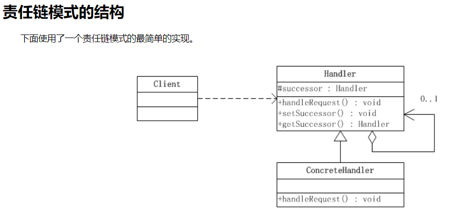

###责任链模式
参考链接：
* http://www.cnblogs.com/java-my-life/archive/2012/05/28/2516865.html
* http://blog.csdn.net/jason0539/article/details/45091639

定义：责任链模式是一种对象的行为模式。在责任链模式里，很多对象由每一个对象对其下家的引用而连接起来形成一条链。请求在这个链上传递，直到链上的某一个对象决定处理此请求。发出这个请求的客户端并不知道链上的哪一个对象最终处理这个请求，这使得系统可以在不影响客户端的情况下动态地重新组织和分配责任。

* Handler：抽象处理者，定义出一个处理请求的接口。如果需要，接口可以定义 出一个方法以设定和返回对下家的引用。这个角色通常由一个Java抽象类或者Java接口实现。上图中Handler类的聚合关系给出了具体子类对下家的引用，抽象方法handleRequest()规范了子类处理请求的操作。

* ConcreteHandler：具体处理者，具体处理者接到请求后，可以选择将请求处理掉，或者将请求传给下家。由于具体处理者持有对下家的引用，因此，如果需要，具体处理者可以访问下家。

####申请聚餐的例子

#### 责任链灵活之处
1. 改变内部的传递规则:在内部，项目经理完全可以跳过人事部到那一关直接找到总经理。每个人都可以去动态地指定他的继任者。

2. 可以从职责链任何一关开始: 如果项目经理不在，可以直接去找部门经理，责任链还会继续，没有影响。

3. 用与不用的区别:不用职责链的结构，我们需要和公司中的每一个层级都发生耦合关系。如果反映在代码上即使我们需要在一个类中去写上很多丑陋的if….else语句。
如果用了职责链，相当于我们面对的是一个黑箱，我们只需要认识其中的一个部门，然后让黑箱内部去负责传递就好了。

####纯的与不纯的责任链模式

* 一个纯的责任链模式要求一个具体的处理者对象只能在两个行为中选择一个：一是承担责任，而是把责任推给下家。不允许出现某一个具体处理者对象在承担了一部分责任后又把责任向下传的情况。

* 在一个纯的责任链模式里面，一个请求必须被某一个处理者对象所接收；在一个不纯的责任链模式里面，一个请求可以最终不被任何接收端对象所接收。

* 纯的责任链模式的实际例子很难找到，一般看到的例子均是不纯的责任链模式的实现。

