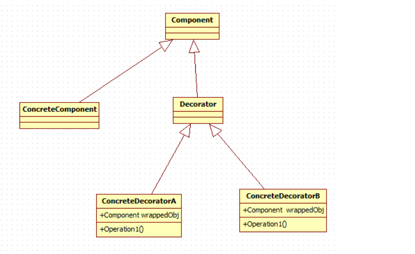

###装饰者模式
参考链接：[刘望舒-装饰者模式](http://blog.csdn.net/itachi85/article/details/51282647)

定义：动态地给一个对象添加一些额外的职责，就增加功能来说，装饰模式比生成子类更为灵活。

* Component：抽象组件
* ConcreteComponent：组件具体实现类
* Decorator：抽象装饰者，继承Component，拓展Component类的功能，但对于Component来说无需知道Decorator的存在
* ConcreteDecorator：装饰者具体实现类。

###装饰模式的优缺点和使用场景

####优点

* 通过组合而非继承的方式，动态的来扩展一个对象的功能，在运行时选择不同的装饰器，从而实现不同的行为。

* 有效避免了使用继承的方式扩展对象功能而带来的灵活性差，子类无限制扩张的问题。

* 具体组件类与具体装饰类可以独立变化，用户可以根据需要增加新的具体组件类和具体装饰类，在使用时再对其进行组合，原有代码无须改变，符合“开闭原则”。

####缺点

* 装饰链不能过长，否则会影响效率。

* 因为所有对象都是继承于Component,所以如果Component内部结构发生改变，则不可避免地影响所有子类(装饰者和被装饰者)，如果基类改变，势必影响对象的内部。

* 比继承更加灵活机动的特性，也同时意味着装饰模式比继承更加易于出错，排错也很困难，对于多次装饰的对象，调试时寻找错误可能需要逐级排查，较为烦琐，所以只在必要的时候使用装饰者模式。

###使用场景
* 在不影响其他对象的情况下，以动态、透明的方式给单个对象添加职责。

* 需要动态地给一个对象增加功能，这些功能可以动态的撤销。

* 当不能采用继承的方式对系统进行扩充或者采用继承不利于系统扩展和维护时。

###装饰模式
* 代理模式和装饰模式有点像，都是持有了被代理或者被装饰对象的引用。它们两个最大的不同就是装饰模式对引用的对象增加了功能，而代理模式只是对引用对象进行了控制却没有对引用对象本身增加功能。