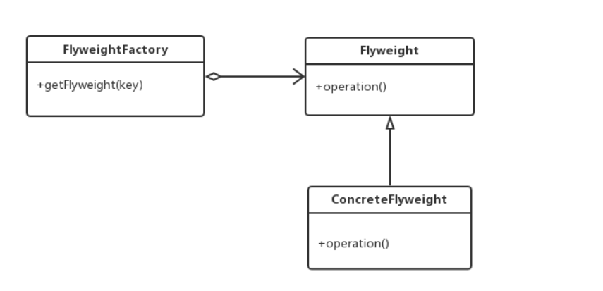

####享元模式（英语：Flyweight Pattern）

参考链接：[刘望舒-享元模式](http://blog.csdn.net/itachi85/article/details/54707942)

定义：享元模式使用共享物件，用来尽可能减少内存使用量以及分享资讯给尽可能多的相似物件；
它适合用于当大量物件只是重复因而导致无法令人接受的使用大量内存。通常物件中的部分状态是可以分享。常见做法是把它们放在外部数据结构，当需要使用时再将它们传递给享元。

* Flyweight：抽象享元角色。
* ConcreteFlyweight，具体享元角色，实现抽象享元角色定义的业务。
* FlyweightFactory：享元工厂，负责管理对象池和创建享元对象。

###享元模式的使用场景
* 系统中存在大量的相似对象。
* 需要缓冲池的场景。
* 对象都具备较接近的外部状态，而且内部状态与环境无关，也就是说对象没有特定身份。

