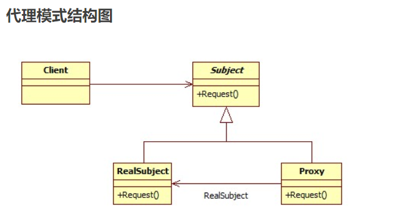

##代理模式
参考链接：[刘望舒-代理模式](http://blog.csdn.net/itachi85/article/details/50912632)

定义：为其他对象提供一种代理以控制这个对象的访问。

* Subject：抽象主题类，声明真实主题与代理的共同接口方法。

* RealSubject：真实主题类，定义了代理所表示的真实对象，客户端通过代理类间接的调用真实主题类的方法。

* ProxySubject：代理类，持有对真实主题类的引用，在其所实现的接口方法中调用真实主题类中相应的接口方法执行。

* Client：客户端类。
