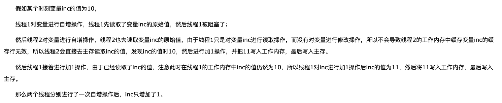

### 关于volatile关键字的一些知识点

#### 如果想要并发程序正确的执行，必须保证原子性、可见性、有序性。

 原子性
 在Java中只有简单的读取、赋值（而且必须是将数字赋值给某个变量，变量之间的相互赋值不是原子操作）才是原子操作。
 
 可见性
 
 对于可见性，Java提供了volatile关键字来保证可见性。
 当一个共享变量被volatile修饰时，它会保证修改的值会立即被更新到主存，当有其他线程需要读取的时候，它会去主存中读取新值。
 
 注意：可见性只能保证每次读取的是最新的值，例如线程A已经读取过了变量x，然后阻塞了，这个过程中B线程修改了x的值。
 当A线程从阻塞中恢复，并不会去重新读取x。
 
 
 
 另外通过synchronized和Lock也能够保证可见性。
 
 
 有序性
 
 指令重排不会影响单个线程的执行，但是会影响到线程并发执行的正确性。
 
 volatile 关键字的作用 一旦一个共享变量（类的成员变量、类的静态成员变量）被volatile修饰之后，那么就具备了两层语义
 
 1. 保证了不同线程对这个变量进行操作时的可见性，即一个线程修改了某个变量的值，这新值对其他线程来说是立即可见的
 即volatile关键字会强制将修改的值立即写入主存。
 
 2. 禁止进行指令重排序。
 

 ### volatile不能保证原子性
 
 举个例子
```java
public class VolatileTest {

    private volatile int inc;

    private CountDownLatch countDownLatch = new CountDownLatch(10);

    private void increase() {

        inc++;
    }

    private volatile AtomicInteger incAnother = new AtomicInteger(0);

    /**
     * 期待结果输出10000
     *
     * @param args
     */
    public static void main(String[] args) {
        final VolatileTest volatileTest = new VolatileTest();
        for (int i = 0; i < 10; i++) {
            new Thread() {
                @Override
                public void run() {
                    for (int j = 0; j < 1000; j++) {
                        volatileTest.increase();
                    }
                    volatileTest.countDownLatch.countDown();
                }
            }.start();
        }

        //保证前面的线程都执行完
        try {
            volatileTest.countDownLatch.await();
        } catch (InterruptedException e) {
            e.printStackTrace();
        }
        System.out.println(volatileTest.inc);

    }
}
```
我们期待结果输出10000，但是多运行几次会发现，有时候输出的结果小于10000。


### volatile在一定程度上可以保证有序性

### volatile使用场景

1. 对变量的写不依赖当前值
2. 该变量没有包含在具有其他变量的不变式中

这两点可以理解为需要保证操作是原子性操作，才能保证使用volatile关键字的程序在并发时能够正确执行。
 
参考链接

[Java并发编程：volatile关键字解析](https://www.cnblogs.com/dolphin0520/p/3920373.html)