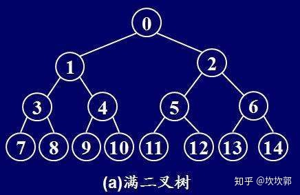

1、满二叉树定义：一个二叉树，如果每一个层的结点数都达到最大值，则这个二叉树就是满二叉树。也就是说，如果一个二叉树的层数为K，且结点总数是(2^k) -1 ，则它就是满二叉树。

2、完全二叉树：深度为k，有n个节点的二叉树当且仅当其每一个节点都与深度为k的满二叉树中编号从1到n的节点一一对应时，称为完全二叉树。
完全二叉树的特点是叶子节点只可能出现在层序最大的两层上，并且某个节点的左分支下子孙的最大层序与右分支下子孙的最大层序相等或大1。

完全二叉树的另一种说法：若设二叉树的深度为h，除第 h 层外，其它各层 (1～h-1) 的结点数都达到最大个数，第 h 层所有的结点都连续集中在最左边，这就是完全二叉树。这种说法比较合理。

* [二叉树](https://baike.baidu.com/item/%E4%BA%8C%E5%8F%89%E6%A0%91/1602879)