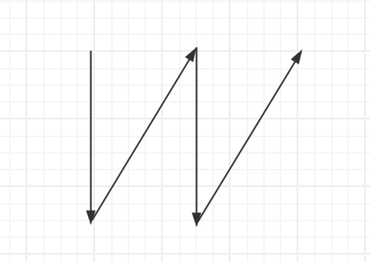

# 应该叫倒N字形变换，更直观，不叫Z字形变换




LeetCode 第 6 号问题“Z 字形变换”（ZigZag Conversion）要求将一个字符串按 Z 字形图案重新排列，然后按行读取结果。以下是问题的算法思路和 Java 实现。

### 算法思路
1. **理解 Z 字形规律**：
    - 给定字符串和行数 `numRows`，字符串会以 Z 字形方式填充到一个虚拟的矩阵中。
    - 第一行和最后一行之间的字符是按一定间隔直接填充的。
    - 中间行的字符会先斜向下、再斜向上，形成“Z”字形。

2. **按行填充**：
    - 使用一个数组或字符串列表来模拟每一行的内容。
    - 遍历字符串，根据当前字符应该属于哪一行，将其追加到对应行的字符串中。
    - 通过一个指针和方向标志来控制字符的行号变化：
        - 从上到下：行号递增，直到 `numRows - 1`。
        - 从下到上：行号递减，直到 0。

3. **合并结果**：
    - 将所有行的字符串拼接起来，得到最终结果。

4. **特殊情况**：
    - 如果 `numRows == 1`，直接返回原字符串。

### 时间与空间复杂度
- **时间复杂度**：O(n)，其中 n 是字符串长度，只需遍历一次字符串。
- **空间复杂度**：O(n)，用于存储每一行的字符。

### Java 实现
```java
public class Solution {
    public String convert(String s, int numRows) {
        // 如果行数为 1，直接返回原字符串
        if (numRows == 1) return s;

        // 使用 StringBuilder 数组来存储每一行的字符
        StringBuilder[] rows = new StringBuilder[Math.min(numRows, s.length())];
        for (int i = 0; i < rows.length; i++) {
            rows[i] = new StringBuilder();
        }

        // 当前行号和移动方向
        int curRow = 0;
        int step = 1; // 1 表示向下，-1 表示向上

        // 遍历字符串
        for (char c : s.toCharArray()) {
            // 将当前字符追加到对应行
            rows[curRow].append(c);

            // 如果到达第一行或最后一行，改变方向
            if (curRow == 0) {
                step = 1; // 开始向下
            } else if (curRow == numRows - 1) {
                step = -1; // 开始向上
            }

            // 更新当前行号
            curRow += step;
        }

        // 合并所有行的结果
        StringBuilder result = new StringBuilder();
        for (StringBuilder row : rows) {
            result.append(row);
        }

        return result.toString();
    }
}
```

### 示例
1. **输入**：`s = "PAYPALISHIRING", numRows = 3`
    - Z 字形排列：
      ```
      P   A   H   N
      A P L S I I G
      Y   I   R
      ```
    - 输出：`"PAHNAPLSIIGYIR"`

2. **输入**：`s = "PAYPALISHIRING", numRows = 4`
    - Z 字形排列：
      ```
      P     I    N
      A   L S  I G
      Y A   H R
      P     I
      ```
    - 输出：`"PINALSIGYAHRPI"`

### 代码说明
- 使用 `StringBuilder` 数组来动态存储每一行的字符，提高追加效率。
- `step` 控制方向：从上到下（+1）或从下到上（-1）。
- 边界检查确保不会越界，`Math.min(numRows, s.length())` 处理字符串长度小于行数的情况。

这个实现高效且易于理解，适用于 LeetCode 的测试用例。如果有其他疑问，欢迎继续提问！